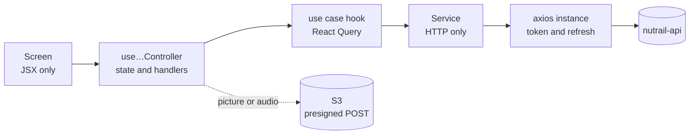

# Nutrail App

[](https://github.com/pedrohdionisio/nutrail-app/actions/workflows/ci.yml)


Mobile app of **Nutrail**, an AI-first food diary. Take a picture of the plate, record a voice note
or type what you ate, and the app shows the foods with calories and macros, against daily goals
calculated from your profile. When you do not know what to cook, it suggests a recipe with what you
have at home.

| Repository | What it is |
|---|---|
| [nutrail-api](https://github.com/pedrohdionisio/nutrail-api) | Serverless REST API, meal processing pipeline and AI integration on AWS |
| **nutrail-app** (this one) | React Native (Expo) app |
| [nutrail](https://github.com/pedrohdionisio/nutrail) | The product overview |

## Contents

- [What it does](#what-it-does)
- [Highlights](#highlights)
- [Architecture](#architecture)
- [Running locally](#running-locally)
- [Testing](#testing)
- [Project layout](#project-layout)
- [Stack](#stack)

## What it does

**Getting started**

- An onboarding in steps — goal, gender, birth date, height, weight and activity level — that ends
  by creating the account and showing the daily plan the API calculated.
- Sign in, and password recovery with a code sent by e-mail.

**Logging meals**

- **Picture:** take it with the camera or pick it from the gallery.
- **Voice note:** record what you ate, in your own words.
- **Typed:** describe the meal, optionally with a picture for the record.
- **Saved meal:** log again, in one tap, a meal you saved with a name ("my usual breakfast").
- **Recipe:** log a saved recipe as a meal.

Pictures and voice notes are analyzed in the background: the meal shows up on the day as
"analyzing" and fills in by itself, and a failed analysis can be retried from the list.

**Following the day**

- Calories and macros consumed against the goals, with the day's meals, one day at a time.
- Meal details with every item, the picture and the totals.
- Edit a meal: change quantities, remove items, add a new one described in words, move it to
  another date or time.
- Save a meal for later, or delete it with a swipe.

**Recipes, goals and profile**

- Ask for a recipe from what you have at home; keep it only if you like it.
- Edit the goals by calories or by macros, each one kept consistent with the other.
- Update the profile (which recalculates the goals), change the password, sign out or delete the
  account.
- Switch the app between Portuguese and English.

## Highlights

- **A background analysis the user can follow.** After uploading a picture or a voice note, the app
  waits for the analysis on the capture screen and, if the user leaves, the day's list refreshes
  itself while any meal is still being analyzed — and stops once none is.
- **Uploads straight to S3.** The API returns a presigned POST; the app resizes the picture to
  1600 px as JPEG before sending it, so the request never goes through a Lambda.
- **Editing without spending AI.** Changing only the quantity of an item recalculates its macros on
  the device by a rule of three; a new food or a different unit goes to a synchronous analysis
  endpoint.
- **The local day is the user's day.** Dates and times always come from the device clock, never
  from UTC, so a dinner at 10 p.m. in Brazil stays on the right day. Tests run in
  `America/Sao_Paulo` to keep it that way.
- **Portuguese and English, end to end.** The language follows the device and can be switched
  in the profile, instantly. Every request carries it, so the AI names the foods, writes the recipes
  and sends the e-mails in the same language; dates are typed `DD/MM/YYYY` or `MM/DD/YYYY` to
  match. Keys are typed: a text missing in one language fails the TypeScript build.
- **Errors in the user's language, not the server's.** The API answers an error code; the app maps
  each one to a message in the active language, and forms validate with the same rules as the API
  before sending.
- **Session in the secure store.** Tokens live in `expo-secure-store`, and a `401` triggers one
  shared refresh, however many requests fail at once, before signing out.
- **Quality gate on every commit and push.** Husky and lint-staged run Biome and the TypeScript
  compiler before each commit; GitHub Actions runs them again with the test suite and a JavaScript
  bundle of both platforms.

## Architecture

Three layers at the top of `src/`, each with its own import alias, and dependencies that point one
way only: `presentation` → `data` → `shared`.

| Layer | Responsibility |
|---|---|
| `data/` | Everything outside the app: API services, React Query use cases, the auth context, secure storage, camera, gallery and audio helpers |
| `presentation/` | Screens, components and layouts, each screen with a `use…Controller` hook for its logic |
| `shared/` | Navigation, entities, constants, utilities and hooks |

Each API resource is a module under `data/modules/<resource>/` with a `services/` file that only
talks HTTP and `useCases/` hooks that wrap it in React Query. `axios`, `useQuery` and `useMutation`
never appear outside `data/`, and one screen never imports another.



## Running locally

Requirements: Node.js (see `.nvmrc`), Yarn 1, and Xcode or Android Studio: `yarn ios` and
`yarn android` make a native build, which the camera and the microphone need.

```bash
yarn install
cp .env.example .env
yarn ios        # or: yarn android
```

| Variable | What it is |
|---|---|
| `EXPO_PUBLIC_API_URL` | The API Gateway URL of a deployed [nutrail-api](https://github.com/pedrohdionisio/nutrail-api) stage. The example points to the development stage. |
| `EXPO_PUBLIC_REQUEST_DELAY_MS` | Delays every request in development, to see the loading states. `0` turns it off. |

| Script | What it does |
|---|---|
| `yarn start` | Metro bundler |
| `yarn ios` · `yarn android` | Native build and run |
| `yarn typecheck` | `tsc --noEmit` |
| `yarn lint` · `yarn format` | Biome check, and check with fixes |
| `yarn test` · `yarn test:coverage` | Jest, and Jest with coverage |

## Testing

| Suite | Tool | What it covers |
|---|---|---|
| Unit | Jest | Masks, formatters, date input in both languages, the item macro recalculation, Zod schemas, API error mapping, the starting language and the `401` refresh interceptor |
| Feature | Jest, React Native Testing Library, MSW | The whole app rendered with its real providers and navigation against a mocked API: session restore and refresh, onboarding and sign-in, password recovery, logging meals by picture, voice, text, saved meal and recipe, the analysis in progress and its failure, meal details and editing, recipes, goals and profile, and switching to English |

```bash
yarn test            # unit and feature
yarn test:coverage   # same, with the coverage report
```

Tests select elements the way a user finds them — role, label and text — and never need the API or
a simulator: every request is answered by a mock of its contract, and the camera, the recorder and
the bottom sheets are replaced by test doubles. There are no end-to-end tests on a device yet.

## Project layout

```
src/
  data/
    config/        axios instances, React Query client, i18n and translations, API error codes, environment
    contexts/      authentication
    libs/          token storage, meal picture and audio helpers
    modules/       one folder per API resource: services, useCases, types, keys
  presentation/
    screens/       one folder per screen, with its controller and components
    components/    shared UI
    layouts/
  shared/
    navigation/    auth and app stacks
    entities/  constants/  hooks/  utils/  assets/
  styles/          Tailwind directives for NativeWind
tests/             mirrors src/, plus support/ with the MSW server, fixtures and mocks
```

The interface is in Portuguese and English, with the translations in `src/data/config/locales`.
Code, identifiers and documentation are in English.

## Stack

Expo SDK 57 · React Native 0.86 · React 19 · TypeScript · NativeWind 4 (Tailwind CSS 3.4) · React
Navigation 7 · TanStack Query · axios · React Hook Form · Zod · expo-camera · expo-image-picker ·
expo-image-manipulator · expo-audio · expo-secure-store · expo-localization · i18next · react-i18next · Gorhom Bottom Sheet · lucide · Jest ·
React Native Testing Library · MSW · Biome · Husky + lint-staged · GitHub Actions

## Author

**Pedro Henrique Dionisio** — [LinkedIn](https://www.linkedin.com/in/pedrohenriquedionisio/)
